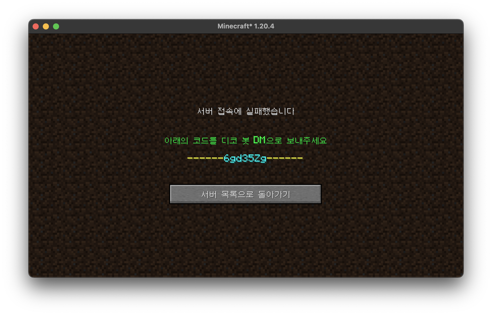

# MC-Discord-Auth

마인크래프트 유저와 디스코드의 계정을 연동하는 플러그인 입니다.

# ScreenShot




# Configuration

config.yml

```yml
BOT_TOKEN: "" (bot token)
SERVER_NAME: "마크" (server name)
```

# License

[GPL-3.0](https://github.com/NOOBNUBY/kotlin-plugin-template/blob/master/LICENSE)